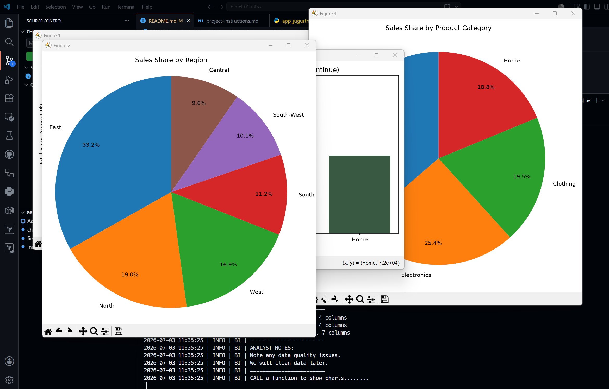

# Project Documentation

This site provides project documentation.
Use the documentation navigation to explore.

## How-To Guide

Many instructions are common to all our projects.

See
[⭐ **Workflow: Apply Example**](https://denisecase.github.io/pro-analytics-02/workflow-b-apply-example-project/)
to get the example projects running on your machine.

## Project Documentation Pages (docs/)

- **Home** - this documentation landing page
- [**Project Instructions**](./project-instructions.md)  - the standard project workflow
- [**Your Files**](./your-files.md) - how to copy the example and create your version
- [**Glossary**](./glossary.md) - project terms and concepts
- [**API**](./api.md) - autogenerated code documentation for the public project interface

---

## Phase 4. Technical Modification

- I added a plot_pie function to create pie charts for sales by region and sales by product category. I also added a percentage column to the sales by region and sales by product category dataframes to show each region's and category's share of total sales.
- I chose this change because it provides a visual representation of the sales distribution, since pie charts show proportion and percentage of each category or region in relation to the whole.
- The code confirmed to be working correctly, as the pie charts were generated successfully and the percentage columns were added to the dataframes. Also, the percentage summed to 100% for both dataframes, confirming the calculations were correct.

## Phase 5. Custom Project (OPTIONAL in Module 1)

### Basis and Data

Three files are provided in `data/raw`:
- `customers.csv` - customer information ( 201 rows: CustomerID, Name, Region, JoinDate)
- `products.csv` - product information ( 100 rows: ProductID, ProductName, Category, UnitPrice)
- `sales.csv` - sales transactions ( 2001 rows: TransactionID, SaleDate, CustomerID, ProductID, StoreID, CampaignID, SaleAmount)

One inconsistent data issue is that the Region column in `customers.csv` has inconsistent capitalization (e.g., "north" vs "North"). This could lead to incorrect grouping or analysis if not standardized.

### Business Questions

- East region has the highest total sales, while the West region has the lowest total sales.
- What the highest and lowest product prices appear to be:
  - Highest: $99.99 (ProductID: P100, ProductName: "Premium Widget")
  - Lowest: $5.99 (ProductID: P001, ProductName: "Basic Widget")
- What data quality issues you noticed:
  - Inconsistent capitalization in the Region column of `customers.csv`
- What business questions you would want to answer with this data
  - What is the sales distribution by region and product category?

### Summary

- I explored the data using Python in VS Code, utilizing pandas for data manipulation and analysis, and matplotlib for visualization.
- The East region had significantly higher sales compared to other regions, which was unexpected given the similar number of customers across regions.
- The data preparation work will involve standardizing the Region column to ensure consistent capitalization, which is crucial for accurate analysis and reporting.
- What kinds of real business problems this data could help answer
  - What is the sales distribution by region and product category?

Display at least one screenshot showing your work.

